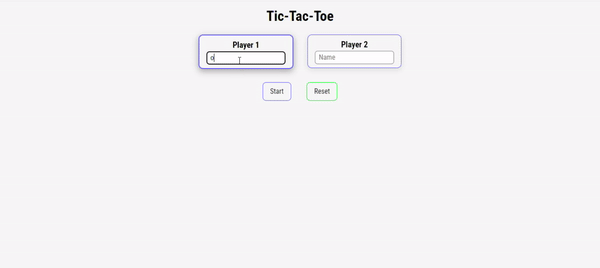

# The Odin Project - Tic-Tac-Toe

## Objective

So the main goal here is to use the recent lesson of using modules and factory function to create a Tic-Tac-Toe game, starting by creating the game in the console and then moving into the window. This was a great challenge to get real hands-on experience with factories and modules and when to use them. It also pushed me to use animations and transition within the game and make the experience more user friendly.

## model 
### index

I want to mainly focus on the JavaScript in this description. I made the entire application using both factory and module functions throughout. I used one factory function to create a player object so that when the user's input is collected, it can be used throughout the application.

Then, I used a module to create the GameBoard, as I need a new board for every round of the game. This module creates a 2D array using a nested `for` loop system and then returns it to be executed in the GameFlow function.

The GameFlow function is the heart of the game. It runs the flow of the game, starting with creating a new game board, then moving on to creating a player array to keep track of both the `activePlayer` and `activeToken`. It uses an event listener and `forEach` loop to add an event listener to each game box. When the user clicks on a game box, it sends the 2D array coordinates to the new game board and inputs them visually and in the back-end 2D array. I encountered a problem where if the user started another game with the same names, it kept the old event listener, and the logic thought the space was taken on the next round. This was fixed by using `once: true` on the event listener and also using `removeEventListener` to ensure no duplications.

I utilized this project to showcase some animations and `box-shadow` properties I had learned previously. It really brought the application to life and made it much more user-friendly. Keeping the web app's display simple was key to focus more on the game itself and the logic behind it.

## Problems encountered
- Resetting the GameBoard once game is finished.
- checking for a draw.
- How to not ask for the name on every turn.
- eventListener was applied on every turn.
- Adding `box-shadow` to look like a button press.
- How to change players and tokens.

## New skills
- Using `.map()` on a 2D array twice to check all the boxes.
- using `window.location.reload()` to reload the page so the user can input new names.
- When the game starts again, it checks to see if the inputs are hidden.
- Added `once: true` to the `addEventListener` and also added a `removeEventListener` to clean up any strays.
- Using a double `box-shadow` and inset to make the tiles look like buttons.
- Using ternary operators to switch between the `activePlayer` and `activeToken`.

## languages
- HTML
- CSS
- JavaScript

